**I.  MINH HỌA CHƯƠNG TRÌNH** 

Có 2 cách để chạy chương trình 

`  `+Có thể mở visual studio để chạy code 

`  `+Chạy file SystemFile.exe trong thư mục Release 

Lưu ý: Phải chạy chương trình bằng quyền quản trị (Run as administrator) 

1. **FAT32** 

Chọn ổ đĩa E:/ có File System là FAT32 để kiểm thử. 

**B1:** Sau khi mở chương trình lên giao diện sẽ hiển thị như hình dưới. Nhập tên ổ đĩa cầm xem (nhập E để demo) 

Giao diện bảng chọn được hiện thị sau khi chọn ổ đĩa: 

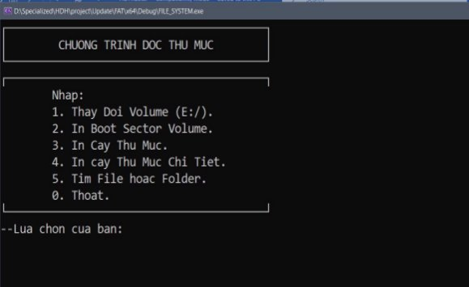

*Nếu bạn muốn thay đổi volume khác có thể nhập số 1.* 

**B2:** Nhập 2 để xem thông tin Boot secter, sau đó nhấn phím bất kỳ để trở lại menu 

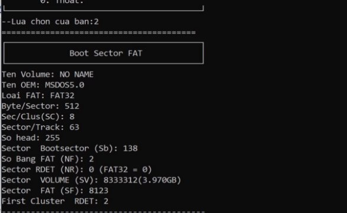

**B3** :Nhập 3 để xem cây thư mục.**  

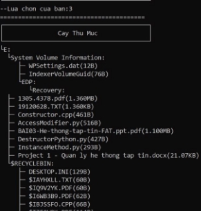 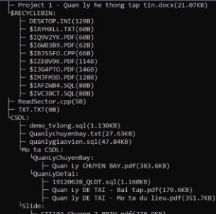

`                               `**1  2** 

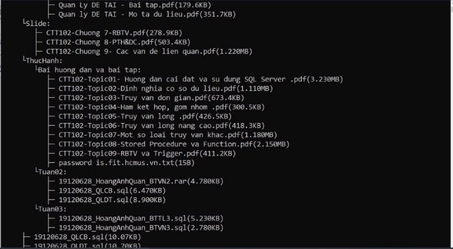

**3** 

**B4** :Nhập 4 để xem chi tiết cây thư mục.**  

*Hình dưới mô tả một phần hiển thị cây thư mục chi tiết.* 

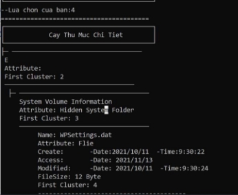 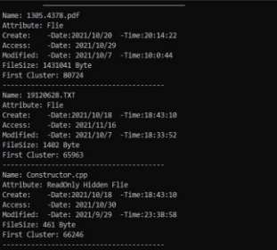

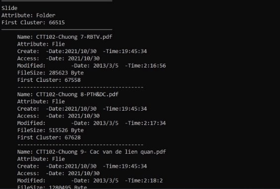

**B5 :**Nhập 5 để tìm file hoặc Folder 

+ Tìm file: 19120628.txt 

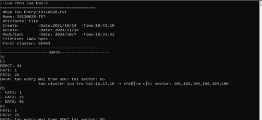

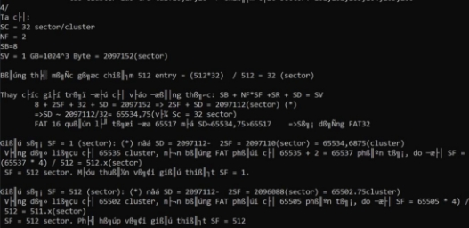

Phần  nội dung để đối chiếu 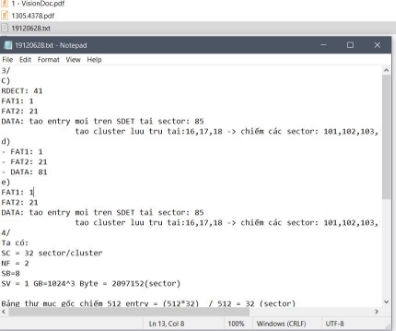

+ Tìm Folder: Mo ta CSDL     (E:/CSDL/Mo ta CSDL) 

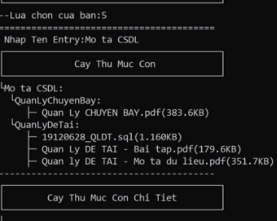 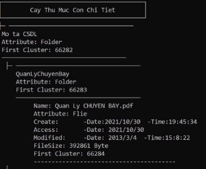

1  2 

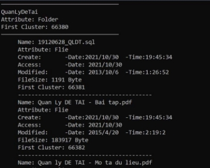

3 

2. **NTFS** 

Chọn ổ đĩa F:/ có File System là NTFS để kiểm thử. 

` ` 

**B1:** Sau khi mở chương trình lên giao diện sẽ hiển thị như hình dưới. Nhập tên ổ đĩa cần xem (nhập F để demo) 

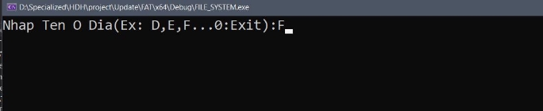

Giao diện bảng chọn được hiện thị sau khi chọn ổ đĩa: 

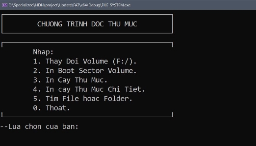

**B2:** Nhập 2 để xem thông tin Patition Boot secter, sau đó nhấn phím bất kỳ để trở lại menu 

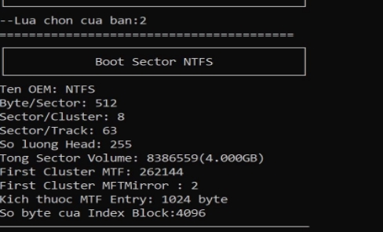

**B3:** Nhập 3 để xem cây thư mục. 

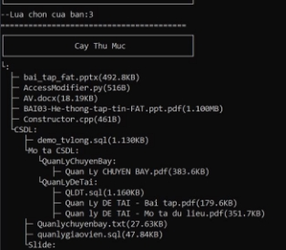 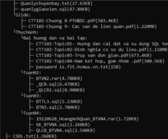

1       2 

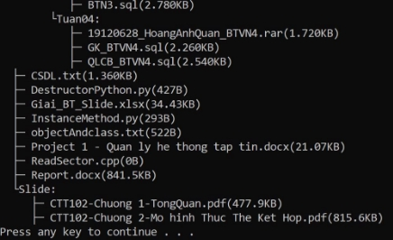

3 

**B4**: Nhập 4 để xem cây thư mục chi tiết 

Một phần của cây thư mục chi tiết 

` `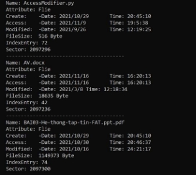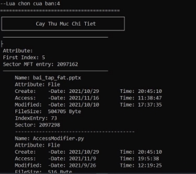

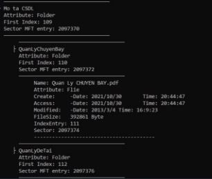

**B5 :**Nhập 5 để tìm file hoặc Folder 

+ Tìm file: Quanlychuyenbay.txt 

Một phần của nội dung do file có kích thước lớn(28302byte) 

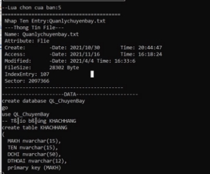 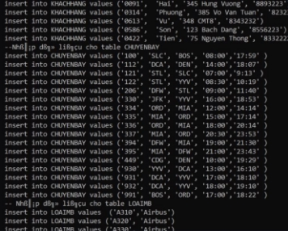

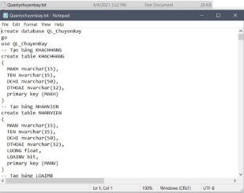

+ Tìm Folder: CSDL  (E:/CSDL) 

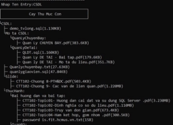 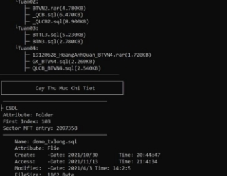

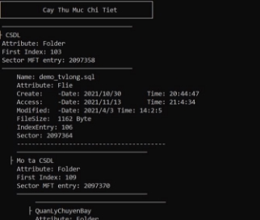
` `13

